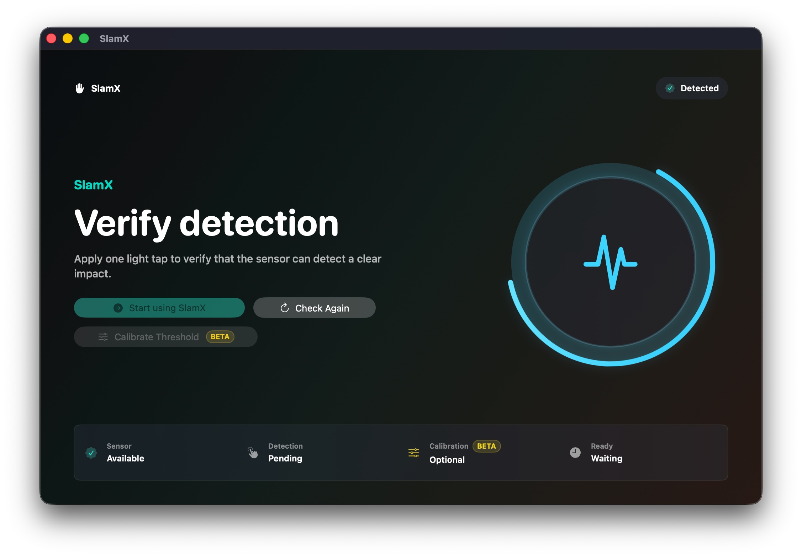
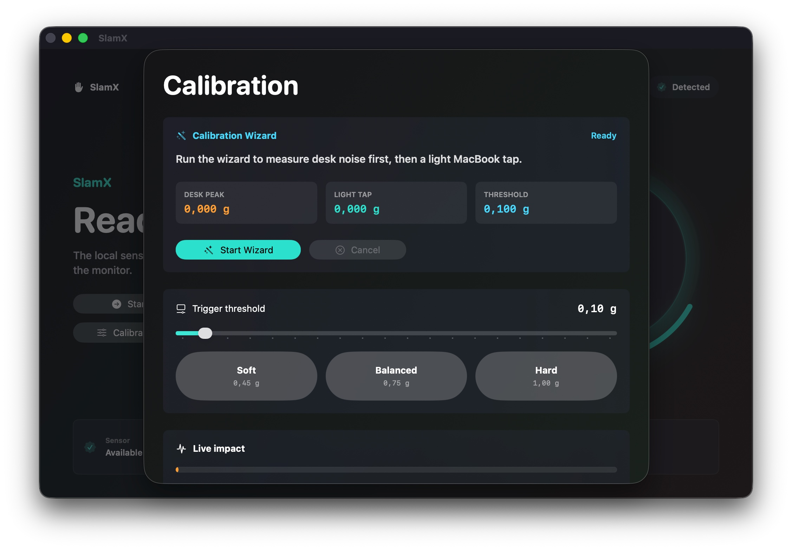
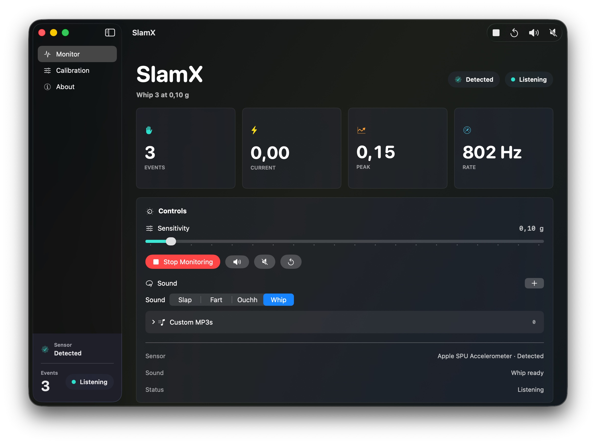

<div align="center">

# SlamX

**A native macOS utility that turns MacBook motion impacts into local sound feedback.**


[](https://github.com/jx-grxf/SlamX/actions/workflows/ci.yml)

</div>

SlamX is a small experimental MacBook utility that listens to the built-in Apple SPU accelerometer, detects sharp impact spikes, increments a counter, and plays local sound feedback.

It is built as a local macOS project: motion samples stay on the Mac, no microphone path exists, and live detection is only available on supported MacBooks.

**By using this app, I agree that Johannes is not liable for any damage to the device if you bang on the MacBook as if you were mining diamonds.**

---

## Showcase

# Onboarding

<p align="center">
  
</p>

# Calibration

<p align="center">
  
</p>

# Dashboard

<p align="center">
  
</p>

---

## Contents

- [SlamX](#slamx)
  - [Showcase](#showcase)
- [Onboarding](#onboarding)
- [Calibration](#calibration)
- [Dashboard](#dashboard)
  - [Contents](#contents)
  - [Highlights](#highlights)
  - [Compatibility](#compatibility)
  - [Why This Exists](#why-this-exists)
  - [Current Workflow](#current-workflow)
  - [Tech Stack](#tech-stack)
  - [Requirements](#requirements)
  - [Quick Start](#quick-start)
  - [Usage](#usage)
  - [Privacy](#privacy)
  - [Release Status](#release-status)
  - [Development](#development)
  - [Research Notes](#research-notes)
  - [Roadmap](#roadmap)
- [Planned for v0.\<\<\<\>\>\>](#planned-for-v0)
  - [License](#license)

---

## Highlights

| Feature | Description |
|---|---|
| Native macOS UI | SwiftUI app with `NavigationSplitView`, toolbar actions, Settings, and a menu bar extra |
| Apple SPU sensor access | Reads the MacBook accelerometer through IOKit HID reports |
| Live telemetry | Shows event count, current impact, peak impact, sample rate, axis values, and raw HID bytes |
| Adjustable detection | Sensitivity slider, presets, and a guided calibration wizard |
| Local audio | Bundles impact, air pop, spotlight, alert, and snap sounds as SwiftPM resources and plays the selected one with `AVAudioPlayer` |
| Mac utility controls | Menu bar controls, launch-at-login, persisted counter and threshold, a global mute shortcut, and Sparkle update checks |
| Testable core | Parser and impact detector are separated into a small Swift library with unit tests |

## Compatibility

| Mac | Status | Notes |
|---|---|---|
| Apple Silicon MacBook with exposed Apple SPU accelerometer | Supported | Intended target |
| Intel MacBook | Unknown | Depends on whether the expected HID device is exposed |
| iMac, Mac mini, Mac Studio, Mac Pro | Unsupported | No MacBook motion sensor |
| Macs without accessible `AppleSPUHIDDevice` | Unsupported | The app intentionally has no microphone fallback |

---

## Why This Exists

MacBooks have internal motion hardware, but Apple does not expose a clean public Core Motion API for MacBook accelerometer data. The practical route for this experiment is the HID stream exposed by `AppleSPUHIDDevice`.

SlamX wraps that low-level stream in a tiny native app with visible telemetry so calibration is not guesswork.

On recent macOS builds the Apple SPU stream may require a privileged helper to wake the sensor driver and receive reports. SlamX starts that local helper only for sensor streaming, so macOS can ask for administrator approval when monitoring begins.

---

## Current Workflow

1. Start the app.
2. Press Start or use the menu bar item.
3. Watch live sensor values and impact intensity.
4. Adjust the threshold until normal desk movement is ignored.
5. Apply a light tap to produce a clear motion spike.
6. SlamX plays the sound and increments the counter.

If no accessible Apple SPU accelerometer is found during onboarding, SlamX explains that the Mac is unsupported. SlamX is sensor-only: either the accelerometer is available, or live detection is unavailable on that Mac.

---

## Tech Stack

| Layer | Technologies |
|---|---|
| Language | Swift 6.3 |
| UI | SwiftUI, Observation |
| Sensor access | IOKit HID, `AppleSPUHIDDevice` |
| Audio | AVFoundation |
| Package | Swift Package Manager |
| Tests | XCTest |

---

## Requirements

- macOS 14 or newer
- Administrator approval for the local sensor helper when macOS requests it
- Apple Silicon MacBook with an exposed Apple SPU accelerometer
- Xcode or Command Line Tools
- Swift 6 compatible toolchain

---

## Quick Start

```bash
DEVELOPER_DIR=/Applications/Xcode.app/Contents/Developer swift test
DEVELOPER_DIR=/Applications/Xcode.app/Contents/Developer swift run SlamX
```

Build a local release app:

```bash
./scripts/package-app.sh 0.3.2 5 / 0.3.3 6 - beta
open .build/xcode-release/Release/SlamX.app
```

Create a local Sparkle-ready DMG and appcast:

```bash
./scripts/create-dmg.sh 0.3.2 5 / 0.3.3 6 - beta
./scripts/generate-appcast.sh .build/dmg
```

Open the native Xcode project for app icon editing, signing, archives, and normal macOS app work:

```bash
open SlamX.xcodeproj
```

---

## Usage

- On first launch, complete the availability check and trigger the onboarding sound test with one light tap.
- Start monitoring from the toolbar, menu bar extra, or `Command-R`.
- Use the threshold slider or calibration wizard to tune detection.
- Choose `Impact`, `Air Pop`, `Alert`, or `Snap` in the sound picker; enable bonus sounds in Settings to unlock `Spotlight`.
- Add custom MP3 files from the Monitor sound control, then select or remove them from the expandable Custom MP3s menu.
- Use the speaker button or `Command-T` to test the selected sound.
- Use `Command-Shift-M` to mute or unmute sounds globally.
- Use the reset button or `Command-0` to clear the counter.

---

## Privacy

- SlamX reads local Apple SPU accelerometer reports through IOKit.
- Motion samples, raw HID bytes, counters, thresholds, and selected sounds are not uploaded.
- Sparkle update checks contact the public update feed configured in `Resources/Info.plist`.
- Custom MP3 files are copied into the app's local support storage only after the user chooses them.

---

## Release Status

SlamX is public-source friendly, but the default release scripts currently create local test builds unless a Developer ID identity is supplied.

| Release concern | Current status |
|---|---|
| Source safety | No secrets, no microphone permission, and no microphone fallback are used |
| Local builds | Supported with Xcode or Command Line Tools |
| Sparkle update feed | Supported, but the feed and DMG must be publicly reachable |
| Developer ID signing | Optional through `CODE_SIGN_IDENTITY`; requires Apple Developer Program membership |
| Notarization | Not implemented yet because it requires Apple Developer Program access |
| Gatekeeper UX | Local/ad-hoc builds may show macOS security warnings |

Do not present a locally built DMG as a polished public binary until it is Developer-ID signed and notarized.

---

## Development

Run the test suite:

```bash
DEVELOPER_DIR=/Applications/Xcode.app/Contents/Developer swift test
```

Run the app in debug mode:

```bash
DEVELOPER_DIR=/Applications/Xcode.app/Contents/Developer swift run SlamX
```

Package the app through the Xcode project:

```bash
./scripts/package-app.sh 0.3.2 5 / 0.3.3 6 - beta
```

Build the release DMG:

```bash
./scripts/create-dmg.sh 0.3.2 5 / 0.3.3 6 - beta
```

Prepare the full GitHub release asset set:

```bash
./scripts/create-release-assets.sh 0.3.2 5 / 0.3.3 6 - beta
```

Build through Xcode:

```bash
DEVELOPER_DIR=/Applications/Xcode.app/Contents/Developer xcodebuild -project SlamX.xcodeproj -scheme SlamX -configuration Debug -destination 'platform=macOS' CODE_SIGNING_ALLOWED=NO build
```

---

## Research Notes

- Apple documents Core Motion primarily for platforms with a public `CMMotionManager` path, but that path is not the right MacBook accelerometer interface.
- Apple documents the HID APIs used here through IOKit, including [`IOHIDDeviceRegisterInputReportCallback`](https://developer.apple.com/documentation/iokit/1588666-iohiddeviceregisterinputreportca).
- The local IORegistry exposes the relevant MacBook stream as `AppleSPUHIDDevice` with usage page `0xFF00` and usage `0x03`.
- Recent Apple SPU drivers need reporting and power state properties to be enabled before the accelerometer emits live reports.
- The app intentionally keeps the parser isolated because Apple can change private report layout details between hardware generations.

---

## Roadmap

# Planned for v0.<<<>>>
- Add Developer ID signing and notarized release packaging after Apple Developer Program enrollment.
- Add a signed release workflow after Developer ID credentials are available.

---

## License

MIT
