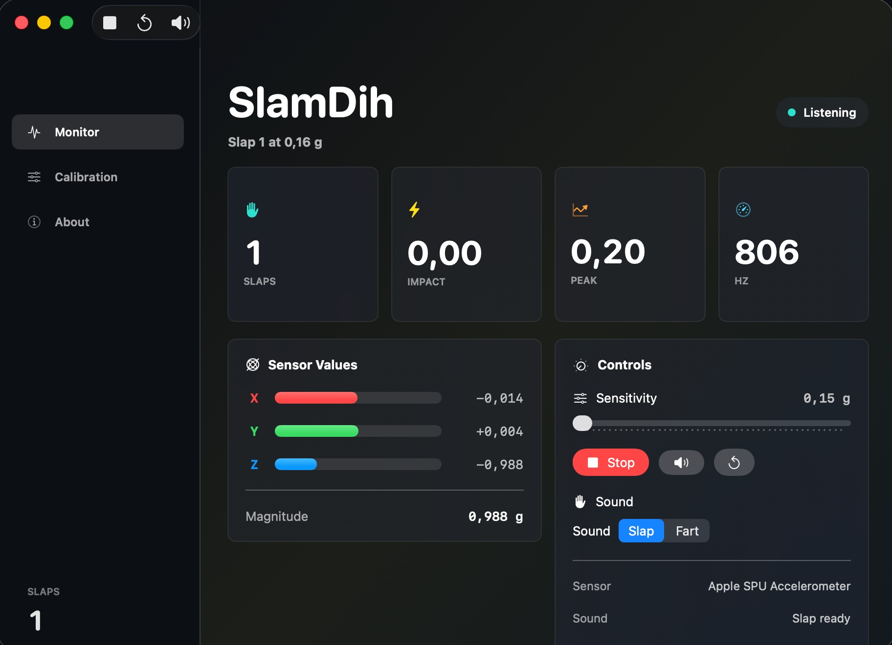

<div align="center">

# SlamDih

**A tiny native macOS app that turns a MacBook slap into a sound effect.**


[](https://github.com/jx-grxf/SlamDih/actions/workflows/ci.yml)

</div>

SlamDih is a small MacBook utility that listens to the built-in Apple SPU accelerometer, detects sharp impact spikes, increments a counter, and plays the bundled slap sound effect.

It is built as a private, local-first macOS tool. No sensor data leaves the machine.

---

# Menu



---

## Contents

- [SlamDih](#slamdih)
- [Menu](#menu)
  - [Contents](#contents)
  - [Highlights](#highlights)
  - [Why This Exists](#why-this-exists)
  - [Current Workflow](#current-workflow)
  - [Tech Stack](#tech-stack)
  - [Requirements](#requirements)
  - [Quick Start](#quick-start)
  - [Usage](#usage)
  - [Development](#development)
  - [Research Notes](#research-notes)
  - [Roadmap](#roadmap)
  - [License](#license)

---

## Highlights

| Feature | Description |
|---|---|
| Native macOS UI | SwiftUI app with `NavigationSplitView`, toolbar actions, settings, and a menu bar extra |
| Apple SPU sensor access | Reads the MacBook accelerometer through IOKit HID reports |
| Live telemetry | Shows slap count, current impact, peak impact, sample rate, axis values, and raw HID bytes |
| Adjustable detection | Sensitivity slider and calibration presets for soft, balanced, and hard impacts |
| Local audio | Bundles slap, fart, sexy, and yowch sounds as SwiftPM resources and plays the selected one with `AVAudioPlayer` |
| Testable core | Parser and impact detector are separated into a small Swift library with unit tests |

---

## Why This Exists

MacBooks have internal motion hardware, but Apple does not expose a clean public Core Motion API for MacBook accelerometer data. The practical route for a private MacBook tool is the HID stream exposed by `AppleSPUHIDDevice`.

SlamDih wraps that low-level stream in a tiny app with visible telemetry so calibration is not guesswork.

---

## Current Workflow

1. Start the app.
2. Press Start or use the menu bar item.
3. Watch live sensor values and impact intensity.
4. Adjust the threshold until normal desk movement is ignored.
5. Slap the MacBook lightly enough to be funny, not expensive.
6. SlamDih plays the sound and increments the counter.

---

## Tech Stack

| Layer | Technologies |
|---|---|
| Language | Swift 6.3 |
| UI | SwiftUI, Observation |
| Sensor access | IOKit HID, `AppleSPUHIDDevice` |
| Audio | AVFoundation |
| Package | Swift Package Manager |
| Tests | Swift Testing |

---

## Requirements

- macOS 14 or newer
- Apple Silicon MacBook with an exposed Apple SPU accelerometer
- Xcode or Command Line Tools
- Swift 6 compatible toolchain

---

## Quick Start

```bash
DEVELOPER_DIR=/Applications/Xcode.app/Contents/Developer swift test
DEVELOPER_DIR=/Applications/Xcode.app/Contents/Developer swift run SlamDih
```

Build a release binary:

```bash
DEVELOPER_DIR=/Applications/Xcode.app/Contents/Developer swift build -c release
```

Create a simple `.app` bundle:

```bash
./scripts/package-app.sh
open .build/release/SlamDih.app
```

Open the native Xcode project for app icon editing, signing, archives, and normal macOS app work:

```bash
open SlamDih.xcodeproj
```

---

## Usage

- Start monitoring from the toolbar, menu bar extra, or `Command-R`.
- Use the threshold slider to tune detection.
- Choose `Slap`, `Fart`, `Sexy`, or `Yowch` in the sound picker.
- Use the speaker button or `Command-T` to test the selected sound.
- Use the reset button or `Command-0` to clear the counter.

---

## Development

Run the test suite:

```bash
DEVELOPER_DIR=/Applications/Xcode.app/Contents/Developer swift test
```

Run the app in debug mode:

```bash
DEVELOPER_DIR=/Applications/Xcode.app/Contents/Developer swift run SlamDih
```

Package the app:

```bash
./scripts/package-app.sh
```

Build through Xcode:

```bash
DEVELOPER_DIR=/Applications/Xcode.app/Contents/Developer xcodebuild -project SlamDih.xcodeproj -scheme SlamDih -configuration Debug -destination 'platform=macOS' CODE_SIGNING_ALLOWED=NO build
```

---

## Research Notes

- Apple documents Core Motion primarily for platforms with a public `CMMotionManager` path, but that path is not the right MacBook accelerometer interface.
- Apple documents the HID APIs used here through IOKit, including [`IOHIDDeviceRegisterInputReportCallback`](https://developer.apple.com/documentation/iokit/1588666-iohiddeviceregisterinputreportca).
- The local IORegistry exposes the relevant MacBook stream as `AppleSPUHIDDevice` with usage page `0xFF00` and usage `0x03`.
- The app intentionally keeps the parser isolated because Apple can change private report layout details between hardware generations.

---

## Roadmap

- Add a first-run calibration pass.
- Persist threshold and counter history.
- Add optional sound selection.
- Add a small signed release workflow after the private repo is created.

---

## License

MIT
